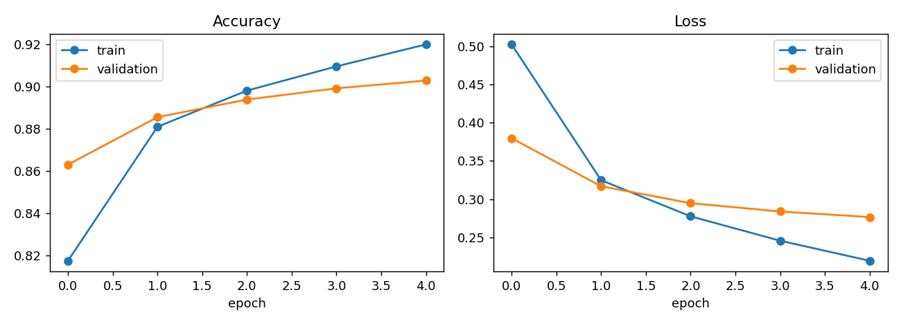
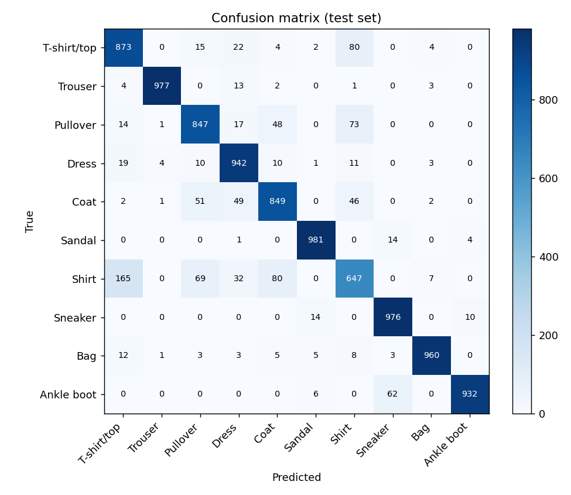

# Fashion-lens

A convolutional neural network that classifies 28x28 grayscale pictures of clothing into 10 categories, wrapped in a Streamlit web app and packaged as a Docker image so it runs the same way on any machine.

Result on the 10,000-image test set: **89.84% accuracy**, loss 0.286, after 5 epochs of training. Details and the per-class breakdown are in [Results](#results).

## Contents

- [What the project does](#what-the-project-does)
- [Repository layout](#repository-layout)
- [Quick start](#quick-start)
- [The dataset](#the-dataset)
- [Preprocessing](#preprocessing)
- [Model](#model)
- [Training](#training)
- [Results](#results)
- [The Streamlit app](#the-streamlit-app)
- [Docker](#docker)
- [Tests](#tests)
- [What I changed from the tutorial](#what-i-changed-from-the-tutorial)
- [Limitations](#limitations)
- [Troubleshooting](#troubleshooting)
- [Ideas for next steps](#ideas-for-next-steps)
- [Credits](#credits)

## What the project does

1. Loads Fashion MNIST, scales it, and trains a small CNN in a Jupyter notebook.
2. Saves the trained model to `app/trained_model/`.
3. Serves the model through a Streamlit page where you upload an image and get a predicted category with a confidence score.
4. Builds the app and model into a Docker image, so anyone with Docker can run it with two commands and no Python setup.

## Repository layout

```text
.
├── app/
│   ├── trained_model/
│   │   └── trained_fashion_mnist_model.keras   # saved model (1.2 MB)
│   ├── classifier.py        # preprocessing, model loading, prediction
│   ├── main.py              # Streamlit UI
│   ├── requirements.txt     # pinned runtime dependencies
│   ├── Dockerfile
│   ├── .dockerignore
│   ├── config.toml          # Streamlit server settings
│   └── credentials.toml     # stops Streamlit asking for an email on first run
├── model_training_notebook/
│   └── fashion_mnist_cnn.ipynb   # data, training, evaluation, saving
├── assets/                  # figures and metrics.json written by the notebook
├── test_images/             # one sample image per class, for trying the app
├── scripts/
│   └── make_test_images.py  # regenerates test_images/
├── tests/
│   └── test_classifier.py
├── requirements-train.txt   # extra packages for retraining and testing
├── .gitignore
└── README.md
```

I split `classifier.py` out of `main.py` so the preprocessing and prediction logic can be tested without opening a browser. `main.py` only handles the page.

## Quick start

### Option 1: Docker (no Python needed)

```bash
git clone https://github.com/Sayanjones/fashion-mnist-end-to-end-project.git
cd fashion-mnist-end-to-end-project/app

docker build -t fashion_mnist_classifier_app:v1.0 .
docker run -p 8501:8501 fashion_mnist_classifier_app:v1.0
```

Open http://localhost:8501. On Linux you may need `sudo` in front of the docker commands. On an Apple Silicon Mac, see [Troubleshooting](#troubleshooting).

### Option 2: run it with Python

You need Python 3.11 or newer (I developed on 3.12).

```bash
git clone https://github.com/Sayanjones/fashion-mnist-end-to-end-project.git
cd fashion-mnist-end-to-end-project

python -m venv .venv
source .venv/bin/activate        # Windows: .venv\Scripts\activate

pip install -r app/requirements.txt
cd app
streamlit run main.py
```

### Option 3: retrain the model yourself

```bash
pip install -r requirements-train.txt
cd model_training_notebook
jupyter lab
```

Open `fashion_mnist_cnn.ipynb` and run all cells. It overwrites the model in `app/trained_model/` and the figures in `assets/`. Training took a few minutes on a CPU for me. The seed is fixed at 0, but TensorFlow on different hardware or versions can still give results that differ in the second or third decimal place.

### Try it

Upload any file from `test_images/`. They are the first test-set image of each class, scaled up to 224x224. The model gets all 10 right, but keep in mind these come from the same distribution the model was evaluated on, so that is a smoke test and not a measure of how it handles your own photos (see [Limitations](#limitations)).

## The dataset

[Fashion MNIST](https://github.com/zalandoresearch/fashion-mnist) is a set of article images from Zalando, built as a harder drop-in replacement for the original handwritten-digit MNIST. Keras downloads it for you.

| | Training | Test |
|---|---|---|
| Images | 60,000 | 10,000 |
| Shape | 28 x 28 | 28 x 28 |
| Channels | 1 (grayscale) | 1 (grayscale) |
| Pixel values | 0 to 255 | 0 to 255 |
| Images per class | 6,000 | 1,000 |

The ten classes, with the label index the model uses:

| Index | Class | Index | Class |
|---|---|---|---|
| 0 | T-shirt/top | 5 | Sandal |
| 1 | Trouser | 6 | Shirt |
| 2 | Pullover | 7 | Sneaker |
| 3 | Dress | 8 | Bag |
| 4 | Coat | 9 | Ankle boot |

Every class has the same number of images, so plain accuracy is a reasonable headline metric here. On an imbalanced dataset it would not be.

## Preprocessing

Two steps, applied identically in training and in the app:

1. **Scale to 0-1.** Divide every pixel by 255. Inputs of a similar small size keep the gradients well behaved and make training with Adam more stable.
2. **Add a channel axis.** `Conv2D` expects `(batch, height, width, channels)`. A grayscale image has one channel, so `(60000, 28, 28)` becomes `(60000, 28, 28, 1)`.

If the app ever scaled differently from the notebook, the model would still run and still return an answer. It would just be quietly worse. That is why both go through the same arithmetic, and why `tests/` checks the output shape and range.

I also seed `random`, NumPy and TensorFlow with 0 so reruns are as close to identical as the hardware allows.

## Model

```text
Input (28, 28, 1)
  Conv2D 32 filters, 3x3, ReLU          -> (26, 26, 32)     320 params
  MaxPooling2D 2x2                      -> (13, 13, 32)
  Conv2D 64 filters, 3x3, ReLU          -> (11, 11, 64)     18,496 params
  MaxPooling2D 2x2                      -> (5, 5, 64)
  Conv2D 64 filters, 3x3, ReLU          -> (3, 3, 64)       36,928 params
  Flatten                               -> (576)
  Dense 64, ReLU                        -> (64)             36,928 params
  Dense 10 (logits, no activation)      -> (10)             650 params
```

93,322 trainable parameters in total (about 365 KB of weights).

A few notes on the choices:

- **Why this shape.** The first conv layer picks up edges and simple textures, the second combines them into parts (sleeves, straps, soles), and the third into larger pieces. Max pooling halves the spatial size between them, which cuts computation and gives a little tolerance to small shifts in where the item sits.
- **Why the output layer has no softmax.** The model returns raw scores (logits). The loss function applies softmax internally when you pass `from_logits=True`, which is more numerically stable than computing softmax first and then taking the log of very small probabilities. The app applies softmax itself when it wants to show probabilities. `argmax` gives the same class either way.
- **Why `SparseCategoricalCrossentropy`.** The labels are integers from 0 to 9. If they were one-hot vectors like `[0, 0, 1, 0, ...]` I would use `CategoricalCrossentropy` instead. Same loss, different label format.

## Training

| Setting | Value |
|---|---|
| Optimizer | Adam, default learning rate |
| Loss | `SparseCategoricalCrossentropy(from_logits=True)` |
| Metric | accuracy |
| Epochs | 5 |
| Batch size | 32 |
| Validation | 10% of the training set (6,000 images) |
| Seed | 0 |
| Versions | TensorFlow 2.21.0, Keras 3.15.1 |

I hold out part of the training data for validation and only touch the test set once, at the end. That way the final number is an honest estimate and not something I nudged while watching it.

Per-epoch numbers from my run:

| Epoch | Train accuracy | Validation accuracy | Validation loss |
|---|---|---|---|
| 1 | 0.8174 | 0.8630 | 0.3796 |
| 2 | 0.8809 | 0.8855 | 0.3168 |
| 3 | 0.8981 | 0.8938 | 0.2947 |
| 4 | 0.9096 | 0.8992 | 0.2838 |
| 5 | 0.9200 | 0.9028 | 0.2765 |



Validation accuracy is still creeping up at epoch 5, but the gap to training accuracy is widening (92.0% vs 90.3%). Training longer would raise training accuracy faster than validation accuracy. To get further I would add regularization or augmentation first (see [next steps](#ideas-for-next-steps)).

## Results

On the held-out test set:

| Metric | Value |
|---|---|
| Test accuracy | 0.8984 |
| Test loss | 0.2861 |
| Macro F1 | 0.897 |

For comparison, the tutorial reports roughly 90% test accuracy and 0.27 loss. The small difference is expected: I trained on 54,000 images instead of 60,000 because of the validation split, and Keras 3 and TensorFlow 2.21 are not the versions used in the video.

### Per-class performance

| Class | Precision | Recall | F1 |
|---|---|---|---|
| Trouser | 0.993 | 0.977 | 0.985 |
| Sandal | 0.972 | 0.981 | 0.977 |
| Bag | 0.981 | 0.960 | 0.970 |
| Ankle boot | 0.985 | 0.932 | 0.958 |
| Sneaker | 0.925 | 0.976 | 0.950 |
| Dress | 0.873 | 0.942 | 0.906 |
| Coat | 0.851 | 0.849 | 0.850 |
| Pullover | 0.851 | 0.847 | 0.849 |
| T-shirt/top | 0.802 | 0.873 | 0.836 |
| Shirt | 0.747 | 0.647 | 0.693 |



The 89.8% overall figure hides a wide spread. Footwear, trousers and bags are close to solved. The upper-body garments are where the errors are, and Shirt is the worst class by a distance: recall is only 65%.

The most common mistakes on the test set:

| True class | Predicted as | Images |
|---|---|---|
| Shirt | T-shirt/top | 165 |
| T-shirt/top | Shirt | 80 |
| Shirt | Coat | 80 |
| Pullover | Shirt | 73 |
| Shirt | Pullover | 69 |

This makes sense visually. At 28x28 grayscale, a shirt, a T-shirt, a pullover and a coat are all roughly a torso-shaped blob, and what separates them (sleeve length, collar, buttons) is a few pixels. Some of these images are ambiguous even to a person.

## The Streamlit app

The page flow:

1. Upload a `.jpg`, `.jpeg` or `.png`.
2. The app shows your image next to what the model actually receives: the 28x28 grayscale version after preprocessing. This helps a lot when a prediction looks wrong, because you can see what was lost in the resize.
3. Click **Classify**. The app shows the predicted class, the softmax confidence, and a bar chart of the top three classes.

Preprocessing in `classifier.preprocess`:

1. If the image has transparency (RGBA, palette or LA), flatten it onto a white background. Without this, transparent pixels turn black when converted to grayscale.
2. Convert to grayscale and resize to 28x28 with Lanczos resampling.
3. Optionally invert the colors (see below).
4. Divide by 255 and reshape to `(1, 28, 28, 1)`.

**The invert option.** Fashion MNIST items are light on a dark background. Most product photos are the opposite: a dark item on white. A model trained on the dataset has never seen that, so it does badly on it. The sidebar has an "Invert colors" setting with three values. `auto` checks whether the border pixels are mostly bright and inverts if so. `yes` and `no` force it. Auto works for typical catalog photos and can be wrong for busy backgrounds, which is why the override exists.

`@st.cache_resource` loads the model once per server process. Without it, Streamlit would reload the model from disk on every button click, because it reruns the script on each interaction.

Model paths are built from `os.path.dirname(os.path.abspath(__file__))` and not from a hardcoded path or the working directory. That is what lets the same code run on my laptop and inside a Linux container.

## Docker

### The Dockerfile, line by line

```dockerfile
FROM python:3.12-slim
```
A small Debian-based image with Python preinstalled. I use 3.12 because that is what I tested with, and the pinned NumPy needs 3.11 or newer.

```dockerfile
WORKDIR /app
COPY requirements.txt .
RUN pip install --no-cache-dir -r requirements.txt
```
Copy only the requirements file first and install. Docker caches each step, so when I later edit `main.py` it reuses this layer and does not reinstall TensorFlow. `--no-cache-dir` keeps pip's download cache out of the image.

```dockerfile
RUN mkdir -p /root/.streamlit
COPY config.toml /root/.streamlit/config.toml
COPY credentials.toml /root/.streamlit/credentials.toml
```
Streamlit looks for settings in `~/.streamlit`. `config.toml` runs it headless and turns off usage statistics. `credentials.toml` has an empty email, which stops the "enter your email" prompt that would otherwise hang a container waiting for input.

```dockerfile
COPY . .
EXPOSE 8501
```
Copy the app and the model in. `EXPOSE` documents the port. It does not publish it; `-p` at run time does that.

```dockerfile
HEALTHCHECK ... python -c "import urllib.request; urllib.request.urlopen('http://localhost:8501/_stcore/health')"
```
Lets `docker ps` show whether the app is actually responding. I use Python's standard library because the slim image does not include `curl`.

```dockerfile
ENTRYPOINT ["streamlit", "run", "main.py", "--server.port=8501", "--server.address=0.0.0.0"]
```
Starts the app. Binding to `0.0.0.0` matters: inside a container, `localhost` is the container's own loopback, and a server bound only to that is unreachable from your browser.

### Useful commands

```bash
docker build -t fashion_mnist_classifier_app:v1.0 .       # build the image
docker run -p 8501:8501 fashion_mnist_classifier_app:v1.0 # run it; host port : container port
docker run -d -p 8501:8501 --name fashion fashion_mnist_classifier_app:v1.0   # run in background

docker ps                      # running containers
docker ps -a                   # all containers, including stopped
docker logs fashion            # see what the app printed
docker stop fashion
docker container prune         # delete all stopped containers
docker images                  # list images
docker rmi <IMAGE_ID>          # delete an image
```

To use a different host port, change the left side of `-p`, for example `-p 9000:8501` and open http://localhost:9000.

## Tests

```bash
pip install -r requirements-train.txt
pytest tests -q
```

Seven tests cover:

- Output shape, dtype and value range of `preprocess`.
- RGBA and grayscale inputs.
- Transparent PNGs becoming white and not black.
- Auto-invert flipping a light-background image and leaving a dark-background one alone.
- Softmax staying finite for very large inputs.
- A smoke test that loads the saved model and predicts on a blank image, checking the output is a valid probability distribution.

They do not test accuracy. Accuracy is measured in the notebook on the full test set.

I also ran the Streamlit server locally and checked that `/_stcore/health` returns 200, and ran `main.py` through Streamlit's `AppTest` to make sure it renders without exceptions.

## What I changed from the tutorial

| Tutorial | This repo | Why |
|---|---|---|
| Saved as `.h5` | Saved as `.keras` | `.keras` is the native Keras 3 format. HDF5 is legacy and Keras warns about it. |
| Test set also used as validation data | 10% of train held out for validation; test set used once at the end | Choosing epochs or settings by watching the test score makes that score optimistic. |
| `input_shape=` on the first Conv2D | Explicit `keras.Input(...)` layer | Recommended in Keras 3 and avoids a warning. |
| Predict with `argmax` on logits only | Also applies softmax and shows confidence and the top 3 | More useful in a UI, and easier to see when the model is unsure. |
| Resize then grayscale, no handling of background | Transparency flattening, Lanczos resize, optional auto-invert | Real photos look nothing like the dataset without this. |
| Single `main.py` | `classifier.py` plus `main.py` | Lets me test the logic without a browser. |
| Port 80 | Port 8501 | It is Streamlit's default, and port 80 needs elevated rights on some machines. |
| `python:3.10-slim`, unpinned packages | `python:3.12-slim`, pinned versions | NumPy 2.4 needs Python 3.11+. Pins make the build repeatable. |
| No evaluation beyond accuracy | Per-class report, confusion matrix, training curves | One accuracy number does not show that Shirt is the weak class. |
| No tests | pytest suite | Catches preprocessing mistakes early. |

## Limitations

- **The model only knows Fashion MNIST.** It was trained on centered, clean, low-resolution studio images. Photos with clutter, odd angles, models wearing the clothes, or colors and textures it has not seen can produce confident wrong answers. Auto-invert helps with white backgrounds and nothing else.
- **Confidence is not probability.** Softmax scores from a network like this are usually overconfident. A 99% prediction on a photo of a cat is still a 99% prediction. The model has no "none of the above" class.
- **Only ten categories.** It cannot say "hat" or "scarf". It will pick the closest of the ten.
- **Resizing to 28x28 throws away detail.** That is a property of the dataset, but it is the main reason shirts are hard.
- **Single training run.** I report one seed. The second decimal place of accuracy would move if I reran with different seeds, so differences of a few tenths of a percent between this and other implementations are not meaningful.
- **No GPU or inference-speed work.** It is a small model and predictions are fast on a CPU, but I have not benchmarked it.

## Troubleshooting

**Docker build fails on an Apple Silicon Mac (M1/M2/M3).** The pinned `tensorflow-cpu` wheels exist for x86_64 Linux and Windows, not for ARM Linux. Build for the emulated platform:

```bash
docker build --platform linux/amd64 -t fashion_mnist_classifier_app:v1.0 .
docker run --platform linux/amd64 -p 8501:8501 fashion_mnist_classifier_app:v1.0
```

It runs slower under emulation but works.

**`pip install` cannot find `tensorflow-cpu` on macOS.** Replace `tensorflow-cpu==2.21.0` with `tensorflow==2.21.0` in `app/requirements.txt` for local installs.

**`numpy==2.4.4` not found.** Your Python is older than 3.11. Upgrade Python, or pin an older NumPy (and expect to adjust the other pins).

**Browser shows "connection refused" with Docker.** Check you published the port (`-p 8501:8501`) and that nothing else is using 8501. `docker ps` shows the port mapping and `docker logs <container>` shows errors.

**Port already in use.** Use another host port, for example `-p 8502:8501`.

**Predictions look wrong on my own photo.** Look at the "What the model sees" panel. If the item is dark on a light background, set Invert colors to `yes`. If the item is tiny in the frame or the background is busy, crop it tightly first.

**Keras says the model file cannot be loaded.** It was saved with Keras 3. Loading it in TensorFlow 2.15 or older (Keras 2) will fail. Use the versions in `app/requirements.txt`.

## Ideas for next steps

Roughly in the order I would try them:

1. Add dropout or batch normalization and compare validation curves. The train/validation gap is already visible by epoch 5.
2. Add data augmentation (small shifts, flips, rotations) and see whether Shirt recall improves.
3. Train for more epochs with early stopping and a learning-rate schedule.
4. Run several seeds and report mean and standard deviation instead of a single number.
5. Compare against a plain MLP and a ResNet-style model to see what the convolutions actually buy on this dataset.
6. Look at the misclassified Shirt images directly, and try Grad-CAM to see which pixels drive the decision.
7. Add an "unknown" threshold on confidence, or train with out-of-distribution examples, so non-clothing uploads get rejected.
8. Add a GitHub Actions workflow that runs the tests and builds the Docker image on every push.
9. Deploy the container (Hugging Face Spaces, Render or a small cloud VM) and add a live link here.

## Credits

- Dataset: Xiao, Rasul and Vollgraf, "Fashion-MNIST: a Novel Image Dataset for Benchmarking Machine Learning Algorithms", 2017 ([GitHub](https://github.com/zalandoresearch/fashion-mnist)).

Built by Sayan Mandal ([GitHub](https://github.com/Sayanjones), [LinkedIn](https://www.linkedin.com/in/sayan-mandal7)).
